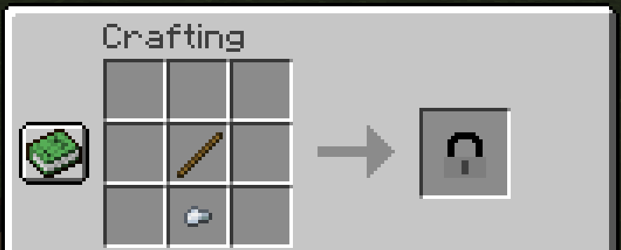
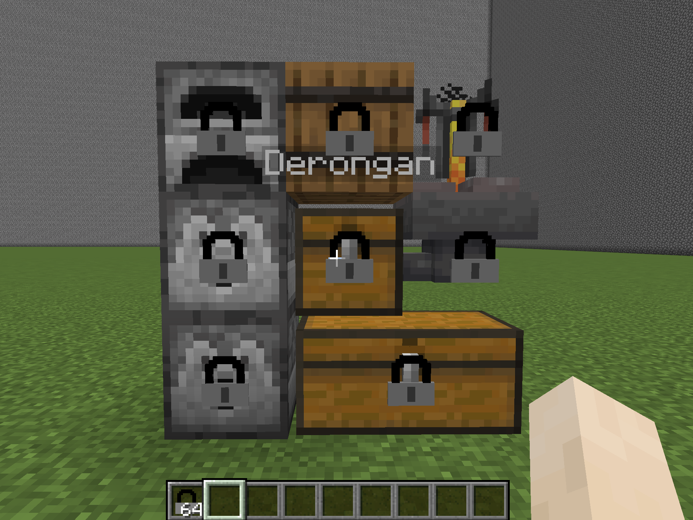

# Padlock

A spigot and forks plugin for locking container blocks.

## Overview

Padlock a simple plugin for locking chests and other containers. Locks are stored within tile
entities removing the need for any form of external persistence (json, yml, database). Blocks are
locked by using padlock items on them. Padlocks are craftable items.

Padlock also displays the padlock item on the locked container. An example resource pack is provided
in the [resourcepack](resourcepack) directory.

Displayed locks will not persist if the plugin is removed. They are created entirely by spoofing
packets.

## Dependencies

Padlock depends on [ProtocolLib](https://github.com/dmulloy2/ProtocolLib) to display locks on
containers.